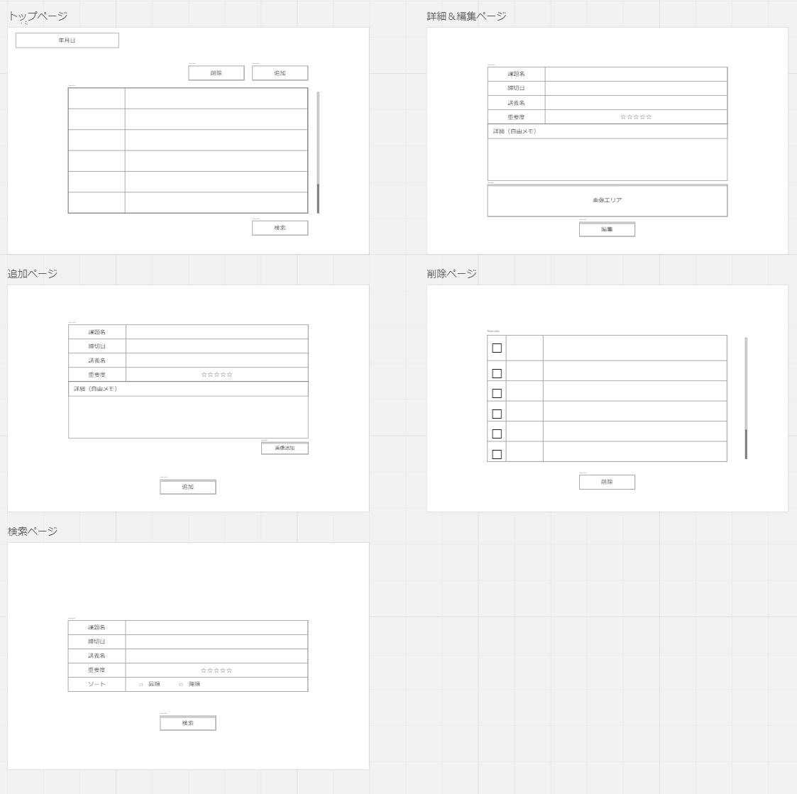

# deadline_memo_web_app(仮)

## 概要
課題の概要をメモして、締切を一括で確認するためのWebアプリケーションです。

## 実行方法
まず、Pythonプロジェクトで使用される外部ライブラリやパッケージを
以下のコードを実行してインストールします。

```bash
pip install -r requirements.txt
```

アプリを実行する前に、 データベースを初期化を行います。
初期化には以下のコードを実行します。

```bash
python data_base_init.py
```

DBの初期化が完了したら、instance/example.dbファイルが生成されます。
アプリを以下のコードで実行します。

```bash
python main.py
```

## 仕様

### 機能
- 課題の締め切りを定期的に通知
- 出された課題をメモできる
- 課題の優先度を重要度という項目で分ける
- 締切順、重要度で課題の並び替え、絞り込み
- メモ欄に以下のような内容などをメモできる
    - 先生から伝えられてた課題の重要ポイント
    - 提出方法
    - 参考にするサイト
    - 提出先リンク

### ディレクトリ構成

#### main.py

flaskの制御を行うファイル。

#### static/css

CSS用ディレクトリ。

#### static/js

JS用ディレクトリ。
fetchやuserIDの取得、期限を残り時間に変換する関数などがある。

#### templates

HTML用ディレクトリ。

- index.html -> トップページ
- detail_edit_page.html -> 詳細＆編集ページ
- add_page.html -> 追加ページ
- remove_page.html -> 削除ページ
- search_page.html -> 検索ページ

#### DataAccess.py

DBをマネジメントするクラス

#### data_base_init.py

アプリを機能する前にDBの初期化をここで行う。
instance/example.dbファイルが生成されたら成功。

### 使用した技術

- Python
- flask
- HTML/CSS
- JavaScript
- SQLite
- localStorage
- プッシュ通知

#### 実装予定

### DBの構造例

- key: 課題ID
- title: 課題名
- deadline: 締切
- subject: 科目名
- memo: メモ
- star_num: 重要度
- created_at: 課題の作成日時
- created_by: 課題を作成したuserID
- updated_at: 課題の更新日時

#### 実装例
```json
{
    "fDja8VuaVy4BGNfXDL1ghm": {
        "title": "進捗報告作成",
        "deadline": "2024-01-25 13:10:00",
        "subject": "オブ演",
        "star_num" : 4,
        "memo": "感想をいっぱい書くこと",
        "created_at": "2024-01-20 01:42:12.455326",
        "created_by": "ffbc963b-d138-4159-ac0b-3101f590ff49",
        "updated_at": "2024-01-20 01:42:12.455326"
    },
    "sFvind8np9Y9dD8wDVvxav": {
        "title": "物理実験レポート",
        "deadline": "2024-02-02 09:00:00",
        "subject": "物理",
        "star_num" : 3,
        "memo": "大変なので早めにやる",
        "created_at": "2024-01-20 01:43:11.152634",
        "created_by": "ffbc963b-d138-4159-ac0b-3101f590ff49",
        "updated_at": "2024-01-22 03:21:09.514263"
    }
}
```

### アプリ画面
